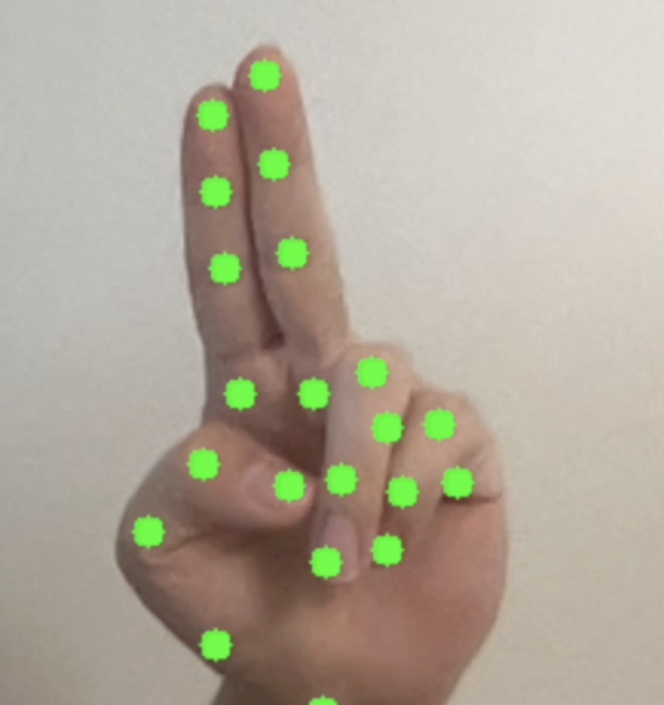
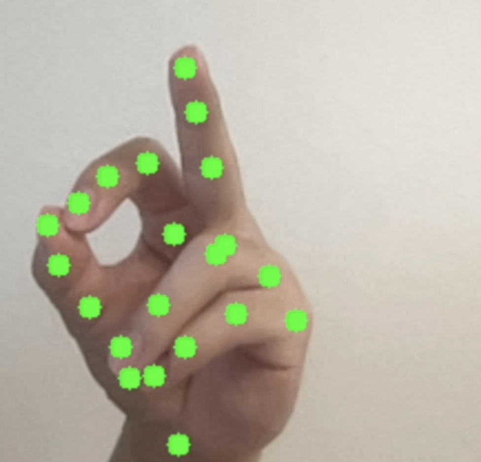
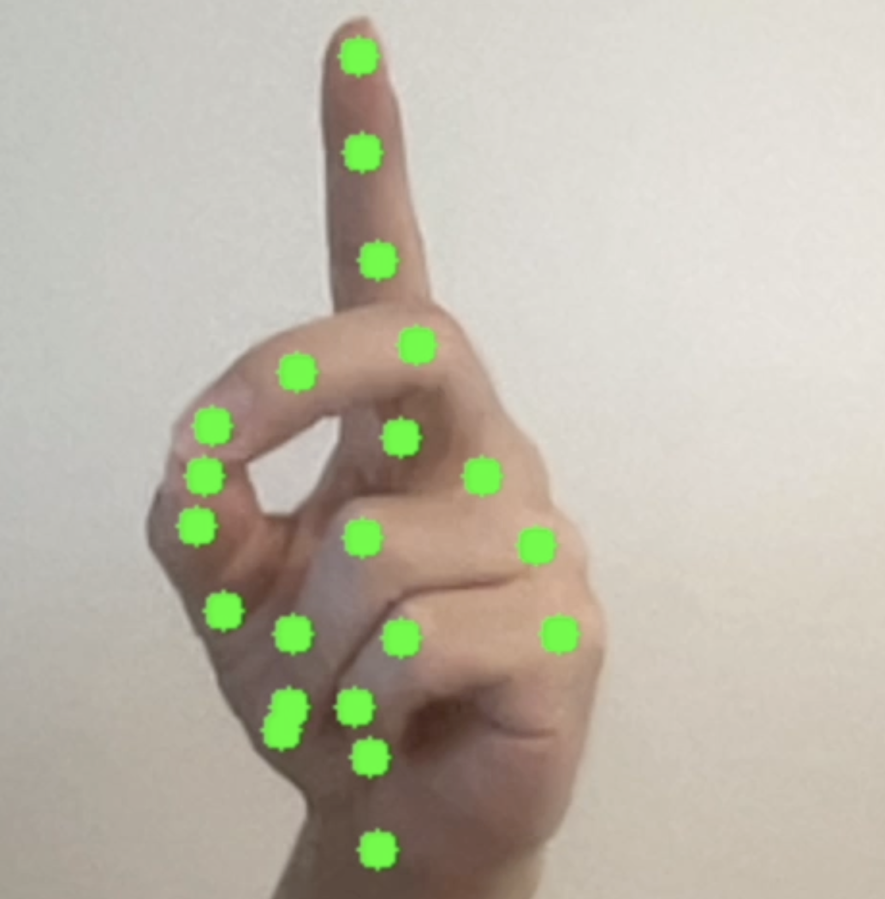

# OpenCV Virtual Trackpad

Recently, my touchpad broke due to water damage. To solve this problem, I built a small program that lets you control your mouse with your hand through a webcam: move the cursor, left/right click, and drag - no additional hardware than a webcam needed.

## How it works

Webcam frames -> MediaPipe detects 21 hand landmarks -> gesture recognition classfies the pose -> PyAutoGui executes real mouse actions.


|     Gesture     |     Action       |

<table>
  <tr>
    <td></td>
    <td>Index + middle finger up<br>Move cursor (middle tip = cursor)</td>
  </tr>

  <tr>
    <td></td>
    <td>Pinch thumb + index<br>Left click (quick) / Drag (hold and move)</td>
  </tr>

  <tr>
    <td></td>
    <td>Pinch thumb + middle<br>Right click</td>
  </tr>
</table>

## Architecture

- `camera.py` — webcam capture, mirroring
- `hand_tracker.py` — MediaPipe HandLandmarker wrapper: landmarks, handedness
- `gesture.py` — pose + pinch state machine → intents (move / click / drag)
- `mouse_controller.py` — camera-to-screen mapping, smoothing, OS mouse events
- `main.py` — the loop wiring it all together  


## Setup
```bash
python -m venv venv

source venv/bin/activate

pip install -r requirements.txt

#if hand_landmarker not downloaded:
#curl -o hand_landmarker.task https://storage.googleapis.com/mediapipe-models/hand_landmarker/hand_landmarker/float16/latest/hand_landmarker.task

python main.py
```


## Done / Roadmap


- [x] Webcam capture module with mirroring
- [x] Hand tracking via Mediapipe Task API (21 landmarks, handedness detection)
- [x] Finger state recognition
- [x] Gesture state machine: move, left click, right click, drag & drop
- [x] Camera to screen mapping with adjustable sensitivity (margin)
- [x] Basic cursor smoothing (exponential blend)
- [ ] Better smoothing
- [ ] Two Hand support 
- [ ] Eye Tracking


## Tech Stack

OpenCV, MediaPipe (Tasks API / HandLandmarker), PyAutoGUI